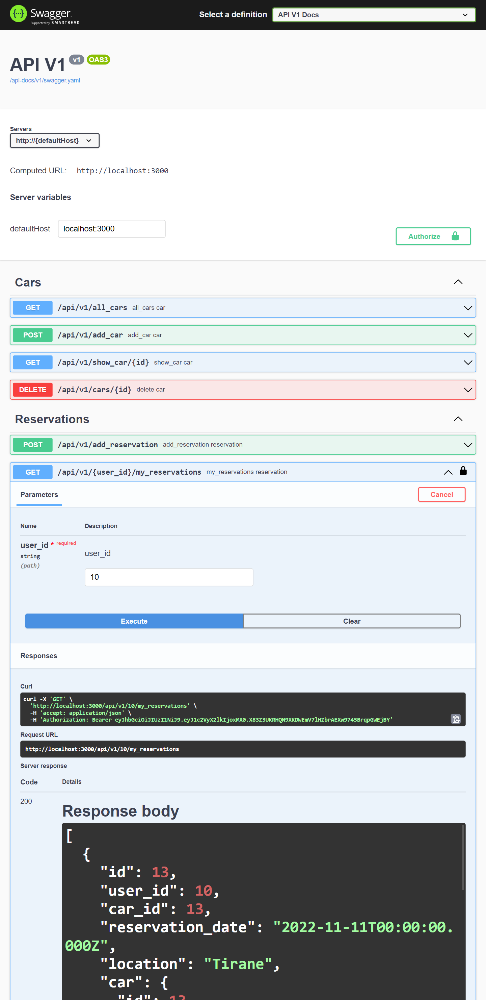

# BOOK_APPOINTMENT-BACK-END

This is backend API for the **BOOK_APPOINTMENT-Front-End** UI, built with Ruby-on-Rails and Postgresql. This API manages reservations for car test runs across various locations.

> 

## Built with

- Ruby version 3.1.2
- Rails (RoR) version 7.0.4
- Postgresql
- Rubocop

## Live Link

You can access the Live version and use the API via [this link](https://luxurycarapi.herokuapp.com/).

## Front-End

You can access the front-end of this application via [this link](https://github.com/jahongiry/book-appointment_front-end).

## Kanban Board:
Kanban Board [link](https://github.com/jahongiry/book-appointment_back-end/projects/1)
**Initial state of the Kanban Board:**


## SetUp

To get a local copy up and running, follow these steps:

- You should have **_Ruby_** installed on your computer.
- You should also have **_Rails_** installed on your computer.
- Clone this repository into your computer by running the following command in your terminal:

```bash
> git clone git@github.com:jahongiry/book-appointment_back-end.git
> cd book-appointment-backend
```

- Run this command in the cloned directory, to install required gems:

```
> bundle install
```

- Then create the posgreSQL database needed for this app, run the migrations and seed data with the following commands:

```bash
> rails db:create
> rails db:migrate
> rails db:seed
```

- Run `Rubocop -A` and fix linters errors, if any.

* Run the project in your browser:

```
rails server
```

## Run Tests

- To run tests, Run the following command on your terminal

```
rake rswag
```

## Deployment

[Live link fron-end](https://sensational-mochi-304065.netlify.app/)

[Live link back-end](https://luxurycarapi.herokuapp.com/)

The above endpoint permits you to see all cars available for reservation. Checkout the api documentation below for the other endpoints.

## API Documentation

Visit [this endpoint](http://localhost:3000/api-docs/index.html) to see a complete documentation of all available endpoints for this API.
We hope this helps you find your way around our API.

## Authors

👤 **Assad Isah**

- GitHub: [@nottherealalanturing](https://github.com/nottherealalanturing)
- LinkedIn: [Assad Isah](https://linkedin.com/in/assadisah)

<hr>

👤 **Emirjeta Veisllari**

- GitHub: [@myelin0](https://github.com/myelin0)
- Twitter: [@Amy_Albania](https://twitter.com/Amy_albania)
- LinkedIn: [@Emirjeta Veisllari](https://www.linkedin.com/in/emirjeta-veisllari/)

<hr>

👤 **Jahongir Yusupov**

- GitHub: [@Jahongir](https://github.com/ekenecf)
- LinkedIn: [jahongir-yusupov](http://linkedin.com/in/jahongir-yusupov)
- Twitter: [JahongirYusup13](https://twitter.com/JahongirYusup13)

<hr>

👤 **Zelalem Fissha**

- GitHub: [@Zelalem1222](https://github.com/Zelalem1222)
- LinkedIn: [zelalemfissha](https://www.linkedin.com/in/zelalemfissha/)
- Twitter: [Zelalem52236790](https://twitter.com/Zelalem52236790)

<hr>

## 🤝 Contributing

Contributions, issues, and feature requests are welcome!

Feel free to check the [issues page](https://github.com/jahongiry/book-appointment_back-end/issues).

## Show your support

Give a ⭐️ if you like this project!

## Acknowledgments

- Coding Partners
- Hat tip to [Microverse](https://www.microverse.org)
- We acknowledge [Murat Korkmaz on Behance](https://www.behance.net/muratk) for designing the wireframe used in this project.

## 📝 License

This project is [MIT](https://github.com/jahongiry/book-appointment_back-end/blob/dev/LICENSE) licensed.
